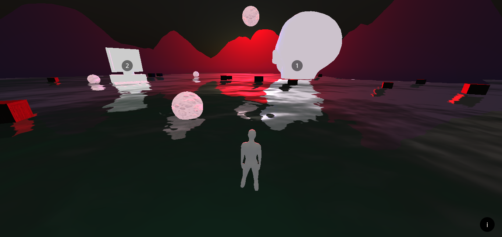

# Three.js demo
  

## About 
Web experience demo build with [three.js](https://threejs.org/), [cannon-es](https://github.com/pmndrs/cannon-es) and [mixamo](https://www.mixamo.com/) animations and model.

[See it live](https://milenagiachetti.github.io/mixamo-three.js/)  
[See it live with debug and stats panels](https://milenagiachetti.github.io/mixamo-three.js/#debug)

## Models and textures sources
- **Mannequin model:** [Mixamo](https://www.mixamo.com/), model modified in Blender to reduce polygons and change material to improve performance.
- **Head model:** [cgtrader](https://www.cgtrader.com/free-3d-models/character/woman/free-base-female-head), model modified in Blender to reduce polygons to improve performance.
- **Computer model:** [cgtrader](https://www.cgtrader.com/free-3d-models/electronics/computer/low-poly-computer).
- **Television model:** [cgtrader](https://www.cgtrader.com/free-3d-models/electronics/video/vintage-tv-a4f79508-a594-4119-a80f-e3151c855af3).
- **Textures:** [3d textures by João Paulo](https://3dtextures.me).